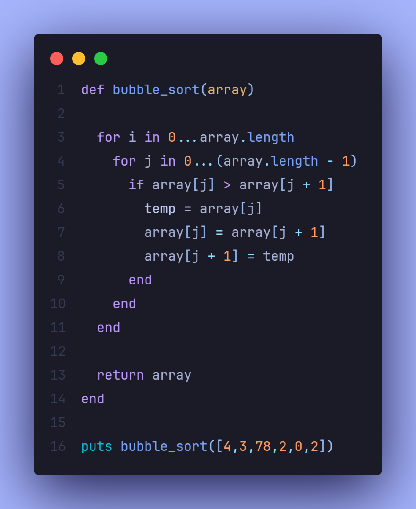

# 

 
 

This project is part of The Odin Project's Ruby course. In this assignment, I implemented the bubble sort algorithm to sort an array of numbers. The project was relatively easier compared to the others so far, as I had already implemented the bubble sort in both C and JavaScript a few times.

 Screenshots

  
    

    

## 📝 Project Objective

The goal was to create a method called bubble_sort that sorts an array by comparing each element to the one next to it, swapping them if necessary. The process repeats until the array is sorted.

## 🔧 Features

- Accepts an array of integers as input.

- Sorts the array in ascending order using the bubble sort algorithm.

- Repeatedly swaps adjacent elements if they are out of order.

- Returns the sorted array after all iterations.

## 📖 Learnings

- **Nested Loops**: Improved understanding of using nested loops for iterative comparison of adjacent elements.

- **Swapping Values**: Refined my approach for swapping values in an array without using built-in methods like sort.

- **Algorithmic Thinking**: Strengthened my grasp of how to translate an algorithm from one language (like C or JavaScript) to another (Ruby), maintaining logic consistency.

## 💻 Technologies Used

- **Ruby** for implementing the bubble sort algorithm and handling array manipulation.

## 💡 Acknowledgments

- **The Odin Project**: For providing the project outline and guidance.
